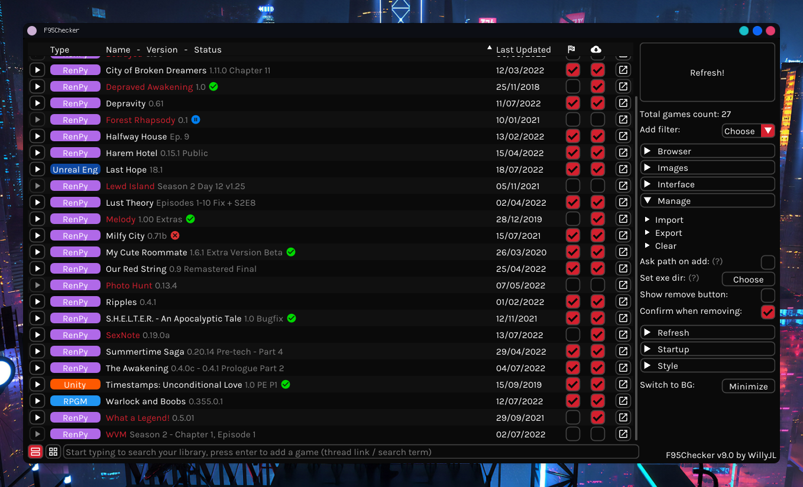

# F95Checker
An update checker tool for (NSFW) games on the [F95Zone](https://f95zone.to/) platform

  

## Features:
 - Blazing fast™ and reliable
 - Beautiful GUI
 - Very easy to setup and use
 - 2FA accounts supported
 - Track what versions you installed and played
 - Launch games straight from the tool
 - Header images support
 - Alert and inbox checker
 - See changelogs
 - See game statuses (completed, on hold, abandoned)
 - Write some notes for the games
 - Auto sorting
 - Auto updating
 - Theme support
 - Background mode

## Compatibility:
Built with Python 3.9.5 for Windows, has compatibility layer for Linux. My daily is a Windows machine so I will try to help you with issues on Linux but I won't go too out of my way to do that... to be fair if you're on Linux, chances are you're somewhat experienced. If you want this for Mac let me know

## Installation:
The tool comes bundled with both windows EXE and python scripts, so you have two ways to install:

#### Windows EXE:
 - Download below and extract
 - Double-click `F95Checker.exe` when you want to use the tool
#### Python script (Linux):
 - Install Python ( 3.9.5 preferably )
 - Download below and extract
 - Install requirements (`pip3 install --upgrade -r requirements_linux.txt`)
 - Run "F95Checker.py" with Python (`python3 F95Checker.py`) or use `F95Checker.sh`

## Download:
Versions after 7.0 are hosted here on GitHub, in the [releases section](https://github.com/Willy-JL/f95checker/releases)

Older versions are hosted on the [F95Zone thread](https://f95zone.to/threads/44173/)

#### Current Version:
**8.4**: [Download v8.4 (GitHub)](https://github.com/Willy-JL/f95checker/releases/download/8.4/F95CheckerV8.4.zip) ([VirusTotal](https://www.virustotal.com/gui/file/1cbecb7d0f55a704b1724ff2bdd28d057f8554be529e7693f95f9dd7f9f4b1e1/detection))

#### Older Versions:

  
Spoiler

**8.3h3**: [Download v8.3h3 (GitHub)](https://github.com/Willy-JL/f95checker/releases/download/8.3h3/F95CheckerV8.3h3.zip) ([VirusTotal](https://www.virustotal.com/gui/file/0eccba159098f5e2fc9f87ce7bab02190b1109064ac4fe06a5f057a9e41fe2c0/detection))

**8.3h2**: [Download v8.3h2 (GitHub)](https://github.com/Willy-JL/f95checker/releases/download/8.3h2/F95CheckerV8.3h2.zip) ([VirusTotal](https://www.virustotal.com/gui/file/ed295f9c93afe37938177e55aa5a554ecd5222e7a09b560381b421a8f0ad387a/detection))

**8.3h1**: [Download v8.3h1 (GitHub)](https://github.com/Willy-JL/f95checker/releases/download/8.3h1/F95CheckerV8.3h1.zip)

**8.3**: [Download v8.3 (GitHub)](https://github.com/Willy-JL/f95checker/releases/download/8.3/F95CheckerV8.3.zip)

**8.2**: [Download v8.2 (GitHub)](https://github.com/Willy-JL/f95checker/releases/download/8.2/F95CheckerV8.2.zip)

**8.1**: [Download v8.1 (GitHub)](https://github.com/Willy-JL/f95checker/releases/download/8.1/F95CheckerV8.1.zip)

**8.0h1**: [Download v8.0h1 (GitHub)](https://github.com/Willy-JL/f95checker/releases/download/8.0h1/F95CheckerV8.0h1.zip)

**8.0**: [Download v8.0 (GitHub)](https://github.com/Willy-JL/f95checker/releases/download/8.0/F95CheckerV8.0.zip)

**7.1h2**: [Download v7.1h2 (GitHub)](https://github.com/Willy-JL/f95checker/releases/download/7.1h2/F95CheckerV7.1h2.zip)

**7.1h1**: [Download v7.1h1 (GitHub)](https://github.com/Willy-JL/f95checker/releases/download/7.1h1/F95CheckerV7.1h1.zip)

**7.1**: [Download v7.1 (GitHub)](https://github.com/Willy-JL/f95checker/releases/download/7.1/F95CheckerV7.1.zip)

**7.0**: [Download v7.0 (GitHub)](https://github.com/Willy-JL/f95checker/releases/download/7.0/F95CheckerV7.0.zip)

**6.9h1**: [View attachment F95CheckerV6.9h1.zip](https://attachments.f95zone.to/2020/09/845085_F95CheckerV6.9h1.zip)

**6.9**: [View attachment F95CheckerV6.9.zip](https://attachments.f95zone.to/2020/09/843628_F95CheckerV6.9.zip)

**6.8h6**: [View attachment F95CheckerV6.8h6.zip](https://attachments.f95zone.to/2020/09/843377_F95CheckerV6.8h6.zip)

**6.8h5**: [View attachment F95CheckerV6.8h5.zip](https://attachments.f95zone.to/2020/09/842394_F95CheckerV6.8h5.zip)

**6.8h4**: [View attachment F95CheckerV6.8h4.zip](https://attachments.f95zone.to/2020/09/841999_F95CheckerV6.8h4.zip)

**6.8h3**: [View attachment F95CheckerV6.8h3.zip](https://attachments.f95zone.to/2020/09/841869_F95CheckerV6.8h3.zip)

**6.8h2**: [View attachment F95CheckerV6.8h2.zip](https://attachments.f95zone.to/2020/09/840413_F95CheckerV6.8h2.zip)

**6.8h1**: [View attachment F95CheckerV6.8h1.zip](https://attachments.f95zone.to/2020/09/840159_F95CheckerV6.8h1.zip)

**6.8**: [View attachment F95CheckerV6.8.zip](https://attachments.f95zone.to/2020/09/840158_F95CheckerV6.8.zip)

**6.7**: [View attachment F95CheckerV6.7.zip](https://attachments.f95zone.to/2020/09/838822_F95CheckerV6.7.zip)

**6.6**: [View attachment F95CheckerV6.6.zip](https://attachments.f95zone.to/2020/09/829961_F95CheckerV6.6.zip)

**6.5**: [View attachment F95CheckerV6.5.zip](https://attachments.f95zone.to/2020/09/826481_F95CheckerV6.5.zip)

**6.4**: [View attachment F95CheckerV6.4.zip](https://attachments.f95zone.to/2020/09/823110_F95CheckerV6.4.zip)

**6.3**: [View attachment F95CheckerV6.3.zip](https://attachments.f95zone.to/2020/09/822764_F95CheckerV6.3.zip)

**6.2h1**: [View attachment F95CheckerV6.2h1.zip](https://attachments.f95zone.to/2020/09/821207_F95CheckerV6.2h1.zip)

**6.2**: [View attachment F95CheckerV6.2.zip](https://attachments.f95zone.to/2020/09/819990_F95CheckerV6.2.zip)

**6.1**: [View attachment F95CheckerV6.1.zip](https://attachments.f95zone.to/2020/09/818507_F95CheckerV6.1.zip)

**6.0**: [View attachment F95CheckerV6.0.zip](https://attachments.f95zone.to/2020/09/817671_F95CheckerV6.0.zip)

**5.3**: [View attachment F95CheckerV5.3.zip](https://attachments.f95zone.to/2020/09/814404_F95CheckerV5.3.zip)

**5.2**: [View attachment F95CheckerV5.2.zip](https://attachments.f95zone.to/2020/09/813995_F95CheckerV5.2.zip)

**5.1**: [View attachment F95CheckerV5.1.zip](https://attachments.f95zone.to/2020/09/813687_F95CheckerV5.1.zip)

**5.0**: [View attachment F95CheckerV5.0.zip](https://attachments.f95zone.to/2020/09/812543_F95CheckerV5.0.zip)

**4.1**: [View attachment F95ZoneGameUpdateCheckerV.4.1.zip](https://attachments.f95zone.to/2020/08/795225_F95ZoneGameUpdateCheckerV.4.1.zip)

**4.0**: [View attachment F95ZoneGameUpdateCheckerV.4.0.zip](https://attachments.f95zone.to/2020/08/793732_F95ZoneGameUpdateCheckerV.4.0.zip)

**3.0**: [View attachment F95ZoneGameUpdateCheckerV.3.0.zip](https://attachments.f95zone.to/2020/07/728088_F95ZoneGameUpdateCheckerV.3.0.zip)

**2.0**: [View attachment F95ZoneGameUpdateCheckerV.2.0.zip](https://attachments.f95zone.to/2020/06/695973_F95ZoneGameUpdateCheckerV.2.0.zip)

**1.3**: [View attachment F95ZoneGameUpdateCheckerV.1.3.zip](https://attachments.f95zone.to/2020/05/687307_F95ZoneGameUpdateCheckerV.1.3.zip)

**1.2**: [View attachment F95ZoneGameUpdateCheckerV.1.2.zip](https://attachments.f95zone.to/2020/01/538687_F95ZoneGameUpdateCheckerV.1.2.zip)

**1.1**: [View attachment F95ZoneGameUpdateCheckerV.1.1.zip](https://attachments.f95zone.to/2020/01/538435_F95ZoneGameUpdateCheckerV.1.1.zip)

**1.0**: [View attachment F95ZoneGameUpdateCheckerV.1.0.zip](https://attachments.f95zone.to/2020/01/538433_F95ZoneGameUpdateCheckerV.1.0.zip)

## How to use:

#### How to use the GUI:
 - Add games by pasting the game thread link in the input box and clicking "Add"
 - Remove games with the edit mode button on the right
 - Check for updates with the HUGE "Refresh!" button
 - If a game was updated you will get a messagebox telling you
 - Click on a game's name to view it's changelog or add some notes to it
 - Open a game by clicking the play button on the left
 - Right click the play button to open the install folder of the game
 - Open a webpage by clicking the "arrow square thingy" on the right
 - Tick the "download" checkbox for games you have installed and then the played checkbox (just left of the installed one) if you played it
 - Change settings on the right under the "Refresh!" button

#### How to use BG Mode:
 - Switch to BG Mode from GUI
 - Tool will minimize to tray
 - Tool refreshes periodically, you can configure how often this happens in the GUI
 - If something happens (any time you would get a popup in GUI Mode) you will get a standard notification
 - You can pause the auto refreshing from the system tray icon (right click)
 - Double click on the tray icon to bring back up GUI Mode
 - Right clicking on the tray icon you can also: view alerts, view inbox, see when the next refresh will happen, manually refresh and exit the tool

#### What the settings do:
 - **Open Pages as Saved HTML**: when you open a webpage it will be first downloaded and then opened as an html file; this is useful because it allows you to view links and spoilers without logging in on the browser
 - **Refresh Completed Games**: when this is **disabled** completed games will not be checked, meaning that refreshing will be faster but of course you might miss out on smaller hotfixes or expansions to those games
 - **Auto Sort**: how the game list will get sorted
 - **Max Retries per Request**: how many times a web request to F95Zone will be retried before failing
 - **Max Threads per Request**: how many threads will be used to refresh, generally speaking should be same or higher than the count of games you have; just leaving it at 100 will let it adjust as needed
 - **BG Refresh Interval (min)**: interval between background mode refreshes in minutes

## How it works:
First of all this script was written in Python 3 and built with Python 3.9.5, makes use of the aiohttp package to make HTTP requests and runs on the PyQt5 window engine, assisted by qasync to work with asyncio loops.
 - Creates a session to keep cookies alive through search requests.
 - Logs into an account (this is necessary to view spoilers / link and to check alerts / inbox).
 - Checks if the link to a game changed (usually the version tag in the thread title changes).
 - If the link changed it loads the thread and grabs new game info.
 - If 1 game or more were updated it notifies you with a messagebox.

## Planned Features Tracker:

#### Soon:
 - Huh... looks like I've run out of feature ideas... hit me up in the replies if you want to suggest something!

#### Far Future:
 - Possibly Mac support, if there's demand for it

## Changelog:

Spoiler

  
v8.4

   - NEW: temporary web login fix, no need to fiddle with cookies anymore
   - FIXED: removed broken requirement on Linux
   - FIXED: refresh button sizing issues on Linux
   - FIXED: a few errors here and there
   - Changed license from MIT to GPLv3, cos' FOSS am I right?

  
v8.3h3

   - FIXED: after updating the tool it should now relaunch properly

  
v8.3h2

   - NEW: checkbox to disable checking of completed games, this will speed up refreshing if you keep completed games in your list. Thanks @GR3ee3N!
   - FIXED: .sh launch script for linux
   - FIXED: new build routine for windows .exe, should not flag antiviruses as much now hopefully. Thanks @GR3ee3N!

  
v8.3h1

   - FIXED: The tool's own update checker runs after refreshing, so you see the game updates popup now
   - FIXED: The tool's own update prompt now shows the changelog in a bigger textbox, easier to read
   - NEW: When checking updates for the tool itself you will see it in the status text (bottom right corner)

  
v8.3

   - NEW: big image viewer: click on an image inside the changelog screen to open it bigger
   - FIXED: login crash when clicking Save / Ok buttons on the login popups
   - FIXED: cursor now shows as pointer over interactable elements
   - NEW: "debug" option in the config file allows to log errors to file

  
v8.2

   - NEW: images support
     - Show game image inside refresh button on game hover
     - Show image header in changelog screen
     - Downloading images goes on in the background
   - FIXED: smoother progress bar, not as noticeable when refreshing very fast / using the EXE version though
   - FIXED: changelog screen more reliable
   - FIXED: smaller code improvements

  
v8.1

   - NEW: filter / search game list by typing in the add box
   - NEW: add games by searching for the name in the add box; will take first result from website's quicksearch
   - FIXED: alphabetical and first added sortings work now
   - FIXED: status badges on alternate rows now have correct background color
   - FIXED: pasting an incomplete / bad link will not add the game

  
v8.0h1

   - FIXED: an issue with enabling 2FA while the tool is open

  
v8.0

   - Switched to HEAD requests (thanks ploper26!):
     - MUCH faster
     - No more issues with games not being found
     - Support any kind of thread (non game threads wont have accurate versions / changelogs, you'll just get notified when the link changes)
     - Restructured the config file, will auto adapt (7.x compatible saved as "pre8.0.json")
     - Max threads are now 999, default 100, will auto adjust to game count (just leave it at 100 if youre unsure)
   - Added 2FA account support
   - Added a notes section to the changelog screen
   - Persistent cookies + login, tool won't need to login every time, 2FA login should last 30 days
   - Added proper window geometry persistency, will remember size and position
   - When opening the GUI it will now appear on top even if you clicked something else while it was loading
   - Added some placeholder text in a few places to clear some things up
   - Changed styling for the tray icon right click menu, now has a gradient and better margins
   - More reliable overall
   - Many other minor refinements and fixes

  
v7.1h2

   - NEW: singleton, now only one instance of the tool can run simultaneously, preventing config issues

  
v7.1h1

   - FIXED: bad import (QtWinExtras) on Linux

  
v7.1

   - NEW: custom thread count, default is 5 threads, should refresh at same speed as before but smoother, I suggest putting it higher only if you have more than 50 games
   - NEW: BG mode aka background mode, hide F95Checker in system tray and have it refresh periodically (every 15 minutes by default)
   - NEW: while refreshing in gui mode, the progress bar shows on the app icon
   - FIXED: added some exceptions for games not being found
   - FIXED: disabled adding and removing games while refreshing
   - FIXED: removed winreg import on linux
   - FIXED: minor bugfixes

  
v7.0

   - IF YOU ARE UPDATING USING THE TOOL ITSELF READ THIS: the download will take some time (it's 36mb) so DONT close the tool even if the window says "Not Responding", just give it some time. After the update is done it will fail to open back up by itself, you will have to open "F95Checker.exe" by yourself!
   - After the long wait, v7.0 is finally here!
   - Completely rewrote the script ANOTHER time, switched from TkInter to PyQt and from requests to aiohttp
   - The refresh process is A LOT faster (multithreaded), and much more reliable
   - Whole new GUI, a lot more stable and much more beautiful, also featuring a theme editor
   - NEW: if some games were updated, you will now get a messagebox telling you
   - NEW: play button, you can now launch games straight from the tool
   - NEW: played checkboxes, very similar to installed checkboxes, you can guess yourself what they do
   - NEW: game statuses, now games will show an icon indicating if they are completed, on hold or abandoned
   - NEW: standalone exe, you dont need to install Python anymore
   - FIXED: connection errors and F95Zone server issues get handled properly
   - FIXED: switched to json config (your previous config will transfer automatically), no more broken configs and angry users
   - FIXED: Opera and OperaGX now get detected properly
   - FIXED: when opening a webpage you wont see the cmd window anymore
   - FIXED: auto updating from now on will be much smoother
   - FIXED: the add text box and button are now pinned

  
v6.9h1

   - Fixed an issue with the popup for inbox and alerts checking not coming up
   - Fixed the game "Life" not being found

  
v6.9

   - First of all, NICE
   - GAME SORTING! Sort the game list based on what you click on the spot; if you select "Last Updated" the list will get automatically sorted after each refresh
   - Minor fixes

  
v6.8h6

   - Added inbox checking (conversations)
   - This time I am 100% confident I fixed changelog saving... no more invalid character error folks
   - Properly updated background mode with recent changes and hotfixes

  
v6.8h5

   - Fixed more issues with exception handling with changelogs
   - Updated background mode... i had kinda.. uhh.. forgotten to add the last 3 hotifixes to background mode... tunnel vision huh?

  
v6.8h4

   - Fixed games not being found if they were not the first result

  
v6.8h3

   - Completely fixed issues with config saving related to invalid characters (for example the recent status 200 myth) (in theory). Now when an illegal character is encountered an error is thrown and the invalid character gets added to exceptions. When this happens before clicking ok please tell me what character caused an issue for you here in this thread!

  
v6.8h2

   - I can now confidently say that open html is fully fixed and spotless, also because if its not ill honestly just delete my system32 and change hobby lol
   - Fixed some reference issues with the window theme and notification icon
   - That's it for today folks its been a long day ill gladly have some sleep

  
v6.8h1

   - Hopefully fixed open html once and for all
   - Made some changes for linux, now you should launch using "F95Checker.sh"

  
v6.8

   - Fixed issue with new config system when the tool is not on the system drive; thanks Cheater1!
   - Fixed an issue with a special character ("•") that would not be saved and cause the changelog fetcher to crash; they get replaced with "-" now
   - Improved adding and removing games: removing now doesn't require a UI reload, so it feels much snappier; adding now automatically scrolls to the bottom and brings focus to the textbox so you don't need to click in it to type in the next game
   - Fixed how the config works, now you weirdos with "%" characters in your passwords won't have issues (jk ily all)
   - Fixed installed checkboxes behavior
   - Fixed linux notifications for background mode
   - Watermark in the bottom right of the gui is now clickable, it takes you to this thread :D
   - Might have fixed other minor stuff, don't remember lol
   - btw only 1 to go for 6.9 nice

  
v6.7

   - FIXED LOGIN STATUS CODE 400 ERROR
   - AUTO UPDATING!
   - Greatly improved and fixed browsers:
     - Only installed browsers are available, others are greyed out
     - Now browsers get launched the proper way, so if you had issues with them like DarK x Duke they should be fixed now
     - Fixed open html option (again)
   - Full Linux support
   - Greatly improved install experience, now it's basically fully automatic and somewhat auto diagnosing
   - Changelogs now get stored: this means that you can view changelogs at any time clicking on a game's name
   - UI tends to be more snappy
   - Last but not least, moved config storage to User's appdata folder
   - If you're coming from a previous installation (i swear this is the last time, the autoupdater will do it in the future for you) i suggest you:
     - Download the new version
     - Copy your old "config.ini" to the new folder
     - Delete your old folder
     - Run "F95Checker.pyw"
   - I kinda rushed this update so i might have missed something, please tell me if you have any issues!

  
v6.6

   - Greatly improved Background mode:
     - Added dynamic icon: icon changes based on status (normal, checking and paused)
     - Added left click action on icon to manually refresh
     - Added games list section to right click menu
     - Added view alerts to right click menu
     - Added next refresh timestamp to right click menu
     - Added refresh now button to right click menu
     - Added Pause button to right click menu: this will pause the automatic refreshes (you can still manually refresh)
   - Improved how open as saved html works: now html files get stored with a unique id so they dont get overwritten
   - If you're coming from 6.5:
     - replace "Background.pyw"
     - replace "F95Checker.pyw"
     - add the missing new files from the "Data" folder
   - If you're coming from 6.1 or newer do all the above and also:
     - replace "requirements.txt"
     - run "install.bat"
   - otherwise please perform a clean install
   - Please report any bugs you find with background mode, I didn't have much time to test it
   - This might be one of the last updates for a while (as in a few months) as I feel like I have reached a good spot with the tool and school starts next week... dont worry though sorting options will come at some point

  
v6.5

   - BACKGROUND MODE!
     - Set up the interval in the normal GUI settings
     - When a game is updated you get a notification right on your desktop
   - Fixed Set GUI Accent Color
   - Fixed Open Pages as Saved HTML
   - If you're coming from 6.1 or newer:
     - copy "Background.pyw"
     - replace "F95Checker.pyw"
     - replace the whole "Data" folder
     - replace "requirements.txt"
     - run "install.bat"
   - otherwise please perform a clean install
   - EDIT (Sept 10 2020, 9 PM EST): updated the 6.5 download with a fixed install.bat that works with pip > 2.1. if you had issues with install.bat they should be fixed now.

  
v6.4

   - Open Pages as Saved HTML now has all clickable links and items working (they take you to the online page so you will not be logged in)
   - Open Pages as Saved HTML now also loads the compressed page (if available) as an html so you can see the compressed download links without having to log in
   - If you're coming from 6.1 or newer simply replace "F95Checker.pyw"; otherwise please perform a clean install

  
v6.3

   - Under the hood update!
   - Completely changed how game data gets stored: now everything is stored in "config.ini" (feel free to delete the .txt files from the Data folder if you have any)
   - Now the tool also stores the game link, the time you added it to the list and the last time it was updated (and also a placeholder "completed" value for the future)
   - What does this mean for you? Not much... now you can use the Open buttons without refreshing first and that's about it
   - What does this mean for the tool's (very near) future? Sorting options are coming! stay tuned...
   - Also changed how the changelog works: now it shows a fixed number of 69 lines of the whole changelog, instead of trying to identify the exact changes; this makes the changelog a whole lot more reliable and also easier to manage for me; also the changelog gets fetched whenever the installed checkbox is not ticked
   - If you're coming from 6.1 or newer simply replace "F95Checker.pyw"; otherwise please perform a clean install

  
v6.2h1

   - Fixed name highlighting with installed checkboxes
   - Fixed "Open Pages as Saved HTML", now the temporary html file gets stored in C:\Windows\Temp and gets deleted a few seconds later; please let me know if you encounter issues with permissions
   - Btw the h1 stands for hotfix 1 :D
   - If you're coming from 6.1 or newer simply replace "F95Checker.pyw"; otherwise please perform a clean install

  
v6.2

   - Resizable GUI! a little kinda a lot laggy... yeah... thats not on me, it's the window engine that is 30 years old... anyway it still works perfectly and the window size persists through restarts; thanks abada25!
   - Games not installed now always have their name highlighted
   - Removed "Export Updated List to File" and "Extra Size" options
   - Fixed a few minor bugs
   - If you're coming from 6.1 simply replace "F95Checker.pyw"; otherwise please perform a clean install
   - Sorry DarK x Duke i couldn't quite fix the issue with the spaces... i know the problem but the normal fix doesn't seem to work... i'll look more into it tomorrow :D
   - EDIT: well it seems that my attempt at fixing the issue with open saved html broke it completely instead... im sorry guys im really tired right now ill fix it tomorrow

  
v6.1

   - Added an Installed Version Tracker, check "How to use" for more info; thanks abada25! (looks like this is becoming a trend around here xD)
   - Added a GUI Accent color picker, so you can express yourself instead of sticking to boring red; thanks abada25!
   - Fixed how config works, now you won't need to reinsert your game list and credentials after each update!
   - Fixed an issue with unreadable text on light Windows themes; thanks yohudood!
   - If you're coming from 6.0 delete and replace (NOT just replace!) the "Data" folder, replace "F95Checker.pyw" and "requirements.txt" and run install.bat; otherwise please perform a clean install

  
v6.0

   - Facelift! The tool now has a new beautiful UI Theme! I've poured my heart and soul into this, please let me know what you think of it!
   - Added a progress bar for the refresh process inside the refresh button itself
   - Swapped yes / no options with checkboxes
   - Changed max retries setting to be an input box with increment arrows
   - Added extra size option, this allows you to make the window bigger (vertically) so you can see more games; thanks for the suggestion DarK x Duke!
   - Added option to sort the game list alphabetically; thanks for the suggestion DarK x Duke!
   - Fixed unintended behavior: now the tool doesn't create a save file for games it can't find
   - If you're coming from a previous installation please completely delete your previous installation folder and files

  
v5.3

   - Added a changelog fetcher for the tool itself
   - Fixed window scrolling behavior
   - Fixed an issue with some pages and the Open HTML option not saving them correctly, ending up in them not opening
   - If you're coming from v5.2 just replace "F95Checker.pyw", otherwise please completely delete your previous installation folder and files

  
v5.2

   - Made the game list section scrollable, thanks for the suggestion abada25! turned out it wasn't too difficult :)
   - Changed where the version number for the tool itself is stored, so in the future you might not need to delete your game list to update the tool
   - If you're coming from a previous installation please completely delete your previous installation folder and files

  
v5.1

   - Added Open HTML option, check "Settings explanation" for more info
   - Added ability add gamed by pasting game id's and game links into the add field
   - Fixed an issue with games that have commas (,) in the name
   - Added browsers: Edge, Opera and Opera GX
   - Changed window updating method, now when you add or remove games the window doesn't need to reload
   - Improved item alignment
   - If you're coming from a previous installation please completely delete your previous installation folder and files

  
v5.0

   - Basically rewrote most of the script (again!)
   - GUI IS HERE!!!
   - Insane speed™ is still here btw
   - Dynamic game management
   - Much more intuitive
   - Much more pleasant to look at (actual gui)
   - Much simpler to use
   - Also trimmed down the name from "F95ZoneGameUpdateChecker" to a much more pleasant "F95Checker"
   - If you're coming from a previous installation please completely delete your previous installation folder and files

  
v4.1

   - Added max retries option to config
   - Improved connection error catching and handling
   - Fixed a basic fatal error that went over my head

  
v4.0

   - Basically rewrote most of the script
   - Completely switched from selenium to requests
   - INSANELY faster than before because of the switch
   - Added config system
   - Added an update checker for the tool itself
   - Added an F95Zone alert (notification) checker
   - Added color support
   - Added browser support (Chrome, Firefox, Brave)
   - Added option to never open webpages
   - Made some features optional (config system)
   - Note: older config files obviously won't work, so please delete everything from your checker folder if you're coming from an older installation

  
v3.0

   - Added checks to make version checking more reliable (side note, this makes the search much more strict and is now case sensitive!)
   - Added a changelog checker that reports the changes in the newest version inside the console
   - Note: since all games write their changelogs in different ways, this is not perfect and many times will not be able to fetch the changes!

  
v2.0

   - Added possibility to open the web pages for selected updated games
   - Note: the browser is temporary and doesn't store any data, so you don't need to worry about clearing the history
   - Note 2: if you open a web page and then exit the script, the browser will close too!

  
v1.3

   - Changed browser driver creation method
   - Added automatic Chrome Driver updating; because of this, if you're coming from previous versions you will have to run the command `pip3 install requests`. For more info check back in "Installation" section

  
v1.2

   - Added the time it took to look up the games to the end message
   - Added file output for updated games

  
v1.1

   - Changed how version number is identified
   - Removed the need to open the game post
   - Overall much faster (~2x faster)
   - As a result of changing how version detection works also fixed a bug with spoilers

  
v1.0

   - First release

## Disclaimer:
I know you might be skeptical about inserting your account credentials into some random dude's program, and I totally agree with you if you are, but you can read through the code and if you can understand anything about coding (not even that, python is really similar to english) you will see that this doesn't do anything harmful. If you still aren't sure you can create a second account just for this program.

## Contributing:
Please do! I poured my heart and soul into this tool and hearing suggestions or getting help or pointer with the code really helps!

## Thanks:
**Huge props to [ploper26](https://f95zone.to/members/1295524/) for suggesting HEAD requests instead of quicksearches!**

**Huge thanks to [GR3ee3N](https://github.com/GR3ee3N), [AtotehZ](https://f95zone.to/members/840616/), [abada25](https://f95zone.to/members/1679118/), [GrammerCop](https://f95zone.to/members/2114990/), [d_pedestrian](https://f95zone.to/members/2616862/), [yohudood](https://f95zone.to/members/26049/), [SmurfyBlue](https://f95zone.to/members/671/), [bitogno](https://f95zone.to/members/605466/), [MillenniumEarl](https://f95zone.to/members/1470797/), [unroot](https://f95zone.to/members/1585550/) and [DarK x Duke](https://f95zone.to/members/1852502/) for the continued support and suggestions!**
